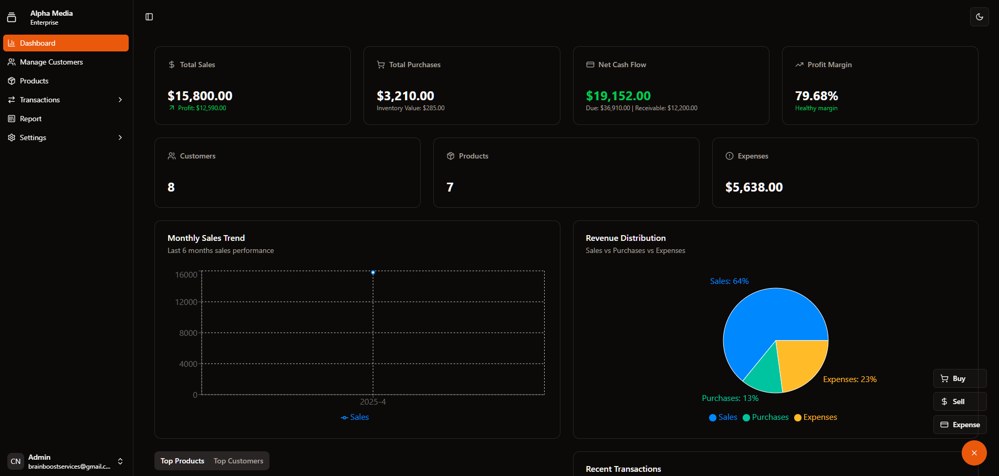

# IPTV Business Management System - Server



## 🖥️ Overview

Backend server for the IPTV Business Management System. This Express.js application provides robust API endpoints for financial tracking, transaction management, customer data handling, authentication, and email/SMS notification services for IPTV business operations.

## 🛠️ Technology Stack

- **Runtime Environment**: Node.js
- **Framework**: Express.js
- **Database**: MongoDB with Mongoose ODM
- **Authentication**: JWT (JSON Web Tokens)
- **Password Security**: bcrypt
- **Request Parsing**: Express built-in parsers with cookie-parser
- **Input Validation**: Zod schema validation
- **Email Service**: Nodemailer
- **HTTP Requests**: Axios (for external API integration)
- **Configuration**: dotenv for environment variables
- **Security**: CORS middleware for cross-origin resource sharing

## 🚀 Features

- **RESTful API**: Comprehensive endpoints for all business operations
- **Secure Authentication**: JWT-based user authentication and authorization
- **Role-Based Access Control**: Admin Role Based Access
- **Data Validation**: Request validation using Zod schemas
- **Transaction Processing**: Endpoints for managing financial transactions
- **Customer Management**: APIs for customer data and others
- **Email Notifications**: Automated email communications using Nodemailer
- **SMS Integration**: External SMS gateway integration (via Axios)
- **Database Operations**: CRUD operations with MongoDB
- **Security Measures**: Password hashing, protected routes, and CORS configuration

## 📋 Prerequisites

- Node.js 18.x or later
- MongoDB 6.0 or later
- npm or yarn
- SMS Gateway account (for production)
- Email account for sending notifications

## 🚀 Getting Started

1. **Clone the repository**

```bash
git clone https://github.com/CodeBuddy07/accounting-server-site.git
cd accounting-server-site
```

2. **Install dependencies**

```bash
npm install
# or
yarn install
```

3. **Environment Setup**

Create a `.env` file in the root directory with the following variables:

```
DATABASE_URL= your-credentials

# JWT Authentication
JWT_SECRET= your-credentials


# Application Configuration
PORT=3000
NODE_ENV=development
FRONTEND_URL=http://localhost:5173

# Email Service
EMAIL_USER= your-credentials
EMAIL_PASS= your-credentials

# SMS Configuration
SMS_API_URL= your-credentials
MANY_SMS_API_URL= your-credentials
SMS_API_KEY= your-credentials
SMS_SENDER_ID= your-credentials
```

4. **Start the development server**

```bash
npm run dev
# or
yarn dev
```

5. **For production deployment**

```bash
npm run start
# or
yarn start
```


## 📝 API Documentation

### Authentication Endpoints

- `POST /api/admin/login` - User login
- `GET /api/admin/logout` - User logout
- `POST /api/admin/auth` - Get current user info
- `POST /api/admin/update-password` - Update user password
- `POST /api/admin/forgot-password` - Request password reset
- `POST /api/admin/reset-password` - Reset password with token

### Customer Endpoints

All routes are protected by authentication middleware.

- `GET /api/customers` - Get all customers
- `POST /api/customers` - Add a new customer
- `PUT /api/customers/:id` - Edit a customer
- `POST /api/customers/:id` - Send SMS to a specific customer
- `DELETE /api/customers/:id` - Delete a customer
- `GET /api/customers/:customerId/report` - Get customer report

### Product Endpoints

All routes are protected by authentication middleware.

- `GET /api/products` - Get all products
- `POST /api/products` - Add a new product
- `PUT /api/products/:id` - Edit a product
- `DELETE /api/products/:id` - Delete a product
- `GET /api/statistics/dashboard` - Get dashboard statistics

### Template Endpoints

All routes are protected by authentication middleware.

- `GET /api/templates` - Get all templates
- `PUT /api/templates/:id` - Update a specific template

### Transaction Endpoints

All routes are protected by authentication middleware.

- `GET /api/transactions` - Get all transactions
- `POST /api/transactions` - Add a new transaction
- `DELETE /api/transactions/:id` - Delete a transaction
- `GET /api/transactions/totals` - Get transaction totals

## 🔒 Security Implementation

The server implements several security measures:

- **Password Hashing**: All passwords are hashed using bcrypt
- **JWT Authentication**: Secure token-based authentication
- **CORS Protection**: Configured to accept requests only from allowed origins
- **Input Validation**: All requests are validated using Zod schemas
- **Error Handling**: Custom error handling to prevent leaking sensitive info
- **HTTP Headers**: Security headers to protect against common vulnerabilities

## 📧 Email Notifications

The server uses Nodemailer to send various types of emails:

- Welcome emails to new customers
- Payment receipts
- Password reset links
- Service updates and announcements

## 📱 SMS Integration

The server integrates with external SMS gateways to send:

- Payment confirmations
- Service notifications
- Special offers and promotions

## 🔄 Database Operations

MongoDB with Mongoose is used for all data operations:

- Document schemas with validation
- Indexing for performance optimization
- Relationship management between collections
- Query middleware for pre/post operations
- Aggregation pipelines for complex reports

## 🚀 Deployment

### Preparing for Production

1. **Environment Setup**:
   - Update all production environment variables
   - Set `NODE_ENV=production`
   - Configure production MongoDB URI

2. **Security Checklist**:
   - Ensure all secrets are properly secured
   - Review CORS configuration
   - Enable rate limiting for production
   - Set up proper logging

3. **Build Process**:
   - Run `npm run build` if using TypeScript (optional)
   - Prepare for deployment with process manager

### Deployment Options

1. **Traditional Hosting**:
   - Deploy with PM2 process manager
   - Configure Nginx as a reverse proxy

2. **Docker Deployment**:
   - Build Docker image using the provided Dockerfile
   - Deploy with Docker Compose for easy scaling

3. **Cloud Services**:
   - Deploy to AWS Elastic Beanstalk
   - Use Heroku for simplified deployment
   - Deploy to Digital Ocean or similar VPS

## 🔧 Troubleshooting

### Common Issues

**Database Connection Problems**:
- Check MongoDB connection string
- Verify network connectivity
- Check MongoDB service status

**Email Sending Failures**:
- Verify SMTP settings
- Check email account credentials
- Inspect spam/security settings of email provider

**SMS Sending Issues**:
- Validate SMS API credentials
- Check SMS gateway status
- Verify sender ID approval status

## 📈 Performance Optimization

The server includes performance optimizations:

- Database indexing strategies
- Query optimization
- Efficient error handling
- Response caching (optional)
- Connection pooling

## 🧪 Testing

Run tests with:

```bash
npm test
# or 
yarn test
```

Test categories include:
- Unit tests for utilities and services
- Integration tests for API endpoints
- Authentication and permission tests
- Data validation tests

## 📄 License

This project is licensed under the MIT License - see the [LICENSE](LICENSE) file for details.

## 👥 Contributing

1. Fork the repository
2. Create your feature branch (`git checkout -b feature/amazing-feature`)
3. Commit your changes (`git commit -m 'Add some amazing feature'`)
4. Push to the branch (`git push origin feature/amazing-feature`)
5. Open a Pull Request

## 📞 Support

For technical support:
- Email: rjruhul05@gmail.com
- Issue Tracker: GitHub Issues


---

⭐️ Developed and maintained by Codever ⭐️